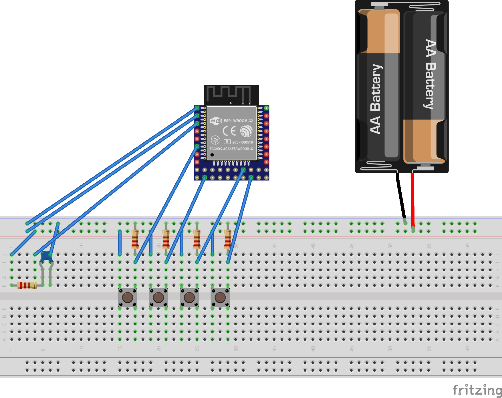

# BabyDailyChart physical button

Physical button for [BabyDailyChart](https://babydailychart.firebaseapp.com) using ESP-WROOM-32.

## Circuit

## Buttons

| Pin No. | Description |
|---|---|
|  2 | Send http request(1) |
| 15 | Send http request(2) |
| 26 | Send http request(3) |
| 32 | Start http server for settings |

## Settings

| Name | Description |
|---|---|
| SSID | SSID for Wi-Fi AP sending http request|
| PASSWORD | password for Wi-Fi AP sending http request|
| API URL | API URL of BabyDailyChart |
| USER ID | USER ID of BabyDailyChart |
| Button1 | Button ID of BabyDailyChart which trigger by GPIO2 pin |
| Button2 | Button ID of BabyDailyChart which trigger by GPIO15 pin |
| Button3 | Button ID of BabyDailyChart which trigger by GPIO26 pin |
